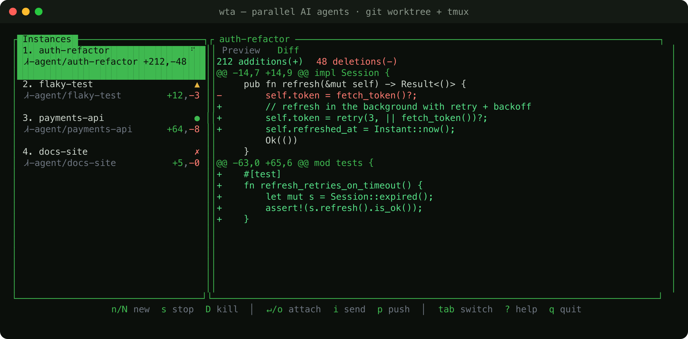

# wta — worktree task agents

Run a fleet of AI coding agents in parallel, each isolated in its own **git
worktree** and a **persistent tmux session**, driven from one keyboard-first
dashboard. Browse them side-by-side, watch their live output, review their
diffs, and drop into any of them to chat — then detach back to the board.

Agents keep running when you close the terminal or your laptop sleeps. Stop one
and resume it later with its work intact. A single ~1 MB Rust binary that runs
in **any terminal** (it does not modify your terminal or shell config).



## Features

- **One worktree + one tmux session per agent** — no two agents touch the same
  files; each has its own branch.
- **Live dashboard** — a sidebar of agents with status, branch and `+adds/-dels`,
  plus a **Preview** (live output) / **Diff** (colorized) pane.
- **Attach & chat** — press `Enter` to jump fullscreen into an agent and type;
  `Ctrl-q` drops you back to the board. Or `i` to send one line without attaching.
- **No trust-prompt babysitting** — auto-accepts Claude's per-folder “Do you trust
  the files in this folder?” on a fresh worktree (strict match, opt out with
  `WTA_AUTO_TRUST=0`), so agents start working without a manual Enter.
- **Live status with no setup** — running vs. waiting is detected automatically.
  Wire the optional Claude Code hooks to also surface “needs input”.
- **Persistent** — sessions survive closing the terminal and laptop sleep.
- **Stop & resume** — stop an agent (keep its worktree) and resume it later; or
  kill it to remove everything.
- **Stays out of your way** — runs on a dedicated tmux server, so it never
  touches your own tmux sessions.

## Requirements

- **tmux** — the agent runtime (persistence, capture, attach).
- **git** ≥ 2.20 — worktree-per-agent.
- an **agent CLI** on your PATH — `claude` by default (`WTA_AGENT_CMD` to change).
- Rust toolchain to build (until prebuilt binaries are published).

## Install

**Homebrew** (macOS / Linux):

```sh
brew install zakrad/wta/wta
```

**Curl** (prebuilt binary, no toolchain):

```sh
curl -fsSL https://raw.githubusercontent.com/zakrad/wta/main/install.sh | bash
```

**Cargo** (from source):

```sh
cargo install --git https://github.com/zakrad/wta                     # core (1.1 MB)
cargo install --git https://github.com/zakrad/wta --features telegram # + remote notifications
```

The core binary is dependency-light; the optional **`telegram`** feature adds the
`wta bridge` remote-notification command (and pulls in TLS). You still need
**tmux** installed (`brew install tmux`).

## Quickstart

```sh
cd your-repo
wta new fix-auth              # worktree .agents/fix-auth on branch agent/fix-auth,
                              #   starts `claude` in a tmux session
wta dash                     # the dashboard: browse, attach, review, manage
```

In the dashboard: `j`/`k` to move, `Enter` to jump into an agent and work,
`Ctrl-q` to come back, `Tab` to see its Diff, `?` for help.

## Agent lifecycle

```
wta new <task>      create worktree + branch + start the agent session
   │
   ├─ attach ────►  Enter/o (or `wta attach <task>`) — type in the agent; Ctrl-q returns
   │
   ├─ stop ──────►  s (or `wta stop <task>`)   session ends, WORKTREE KEPT  → status ✗
   │                     └─ resume ──►  Enter on it (or `wta resume <task>`) — back to work
   │
   └─ kill ──────►  D (or `wta rm <task>`)     session + worktree + branch REMOVED (gone)
```

**Stop vs. kill:** `stop` (`s`) is non-destructive — it ends the tmux session but
keeps the worktree and all uncommitted work. **Resume continues the agent's
previous conversation** (it relaunches with `--continue`), so you pick up the
same Claude Code session, not a blank one. `kill` (`D`) tears everything down.
After a reboot the tmux server is gone but worktrees remain, so agents show `✗`
and resume brings them back.

## Commands

```
wta new <task> [--base <branch>] [-- <agent args>]   worktree + branch + start the agent session
wta [--server default] <cmd>       run agents on your own tmux server instead of the isolated one
wta ls                             list agents with live state + diffstat
wta matrix                         preview which agent branches conflict (pairwise, read-only)
wta attach <task>                  attach to a session (Ctrl-q to detach)
wta stop <task>                    end the session, keep the worktree (resumable)
wta resume <task>                  re-spawn a stopped agent in its worktree
wta push <task> [--pr]             commit + push the agent's branch; --pr opens a PR (gh)
wta rm <task> [--force]            destroy: session + worktree + branch
wta dash                           the live dashboard
wta bridge [--test]                Telegram remote control: notify you + relay your replies to agents
wta status <state>                 emit status (for Claude Code hooks; optional)
wta install-hooks [--global]       wire Claude Code hooks -> `wta status`
```

## Dashboard keys

| key | action |
|---|---|
| `j`/`k` or ↑/↓ | move selection |
| `Shift+↑`/`↓` | scroll the Diff |
| `Tab` | switch Preview / Diff |
| `Enter` / `o` | attach into the agent and type (Ctrl-q returns; on `✗`, resume) |
| `i` | send one line to the selected agent without attaching (only when `● ready`) |
| `n` | new agent |
| `N` | new agent with an initial prompt (sent to the agent on start) |
| `s` | stop (keep worktree — resumable) |
| `D` | kill (destroy worktree + branch, with confirm) |
| `p` | commit + push the branch and open a PR (confirm) |
| `b` | new agent based on an existing branch (filterable picker) |
| `m` | **mergeability matrix** — do the agent branches conflict? |
| `?` | help · `r` refresh · `q` quit |

Status glyphs: `⠋ running` · `● ready` · `▲ needs input` (hooks) · `✗ exited` ·
`· idle`. The colors are ANSI-indexed, so they match your terminal theme.

## Mergeability preview

Before you start merging a fleet of agent branches back to main, `m` in the
dashboard (or `wta matrix`) shows a grid of which branches merge **cleanly**
against each other and against base — computed with `git merge-tree` in memory,
so **no working tree is touched and nothing is committed**. It lists the exact
conflicting files per pair, so you can pick a safe merge order (or send an agent
back to rebase) *before* anything goes wrong. Most tools only surface conflicts
after you try to merge; this previews the whole N×N picture up front.

```
        main    auth    api     ui
main    ·       ✓       ✓       ✓
auth    ✓       ·       ✗       ✓
api     ✓       ✗       ·       ✓
ui      ✓       ✓       ✓       ·

conflicts:  auth ✗ api  — src/server.rs
```

## Persistence & isolation

Agents run as `wta-<task>` sessions on a **dedicated tmux server** (`tmux -L wta`)
configured for a seamless attach — status bar off, mouse on, `Ctrl-q` bound to
detach. Because it’s a separate server, wta never appears in your normal
`tmux ls` and never interferes with your own tmux.

**Why a dedicated socket** (and not your default tmux): wta sets *global* options
(hide the status bar, bind `Ctrl-q`) to make attach feel like a native app. On
your own tmux server that would clobber your config and keybindings — so wta
keeps its own server. The tradeoff: if you launch `wta` from *inside* your own
tmux, attaching would nest tmux-in-tmux, so wta instead opens the agent in a
**`display-popup`** (tmux ≥ 3.2); outside tmux it attaches fullscreen.

**Prefer your own tmux?** Pass `--server default` (or set `WTA_TMUX_SOCKET=default`)
to run agents on your normal tmux server — they show in your `tmux ls`, and from
inside tmux `Enter` uses `switch-client` (no nesting). In this mode wta does
**not** set global options or bind `Ctrl-q` (so it never touches your config); you
detach with your usual tmux keys. The isolated socket remains the default.

## How it compares

wta is in the same family as terminal parallel-agent runners like **Claude
Squad** — a git worktree + a tmux session per agent, browsed from a TUI. wta
leans into tight isolation, hook-aware status, an upfront conflict view, and
remote control.

| | wta | Claude Squad |
|---|---|---|
| Agent runtime | tmux session | tmux session |
| Runs in any terminal | ✅ (single Rust binary) | ✅ (single Go binary) |
| Isolated from *your* tmux | ✅ dedicated socket (`-L wta`) | uses your default tmux server |
| Live status detection | output-hash **+ Claude Code hooks** (`needs input`) | output-hash + prompt-string match |
| Attach / detach | `Enter` / `Ctrl-q` | `Enter` / `Ctrl-q` |
| Stop (keep worktree) + resume | ✅ `s` / `resume` | ✅ pause / resume |
| Diff review in-app | ✅ Diff tab | ✅ Diff tab |
| Commit & push / PR from the UI | ✅ `p` | ✅ |
| New-with-prompt | ✅ `N` | ✅ |
| Branch picker on create | ✅ `b` / `--base` | ✅ |
| Reorder sessions | ✅ `J`/`K` | ✅ |
| Auto-dismiss folder-trust prompt | ✅ (`WTA_AUTO_TRUST`) | ✅ |
| Use your own tmux server | ✅ `--server default` (opt-in) | always (no isolation) |
| **Mergeability preview** (N-way, upfront) | ✅ `m` / `wta matrix` | ❌ |
| **Quick-send without attaching** | ✅ `i` (gated on ready) | ❌ |
| **Remote / mobile control** | ✅ Telegram: notify **+ reply to drive agents** | ❌ |

Where wta leans in: a **dedicated tmux socket** so your own tmux stays clean; a
small **terminal-agnostic binary**; **Claude Code hook** integration for accurate
“needs input”; the **mergeability matrix** that previews cross-branch conflicts
before you merge (nothing else does this); and **Telegram** remote control. It
deliberately does **not** embed a diff-review IDE — review in the Diff tab or
your own editor.

## Remote notifications (Telegram)

Get pinged on your phone when an agent needs input or finishes — so you can walk
away from a fleet of agents and only come back when one wants you.

> Requires the `telegram` feature: `cargo install --git … --features telegram`.

1. Create a bot with [@BotFather](https://t.me/BotFather) and copy its token.
2. Get your chat id (message [@userinfobot](https://t.me/userinfobot)).
3. Export and run the bridge (a small daemon; keep it in its own pane/session):

```sh
export WTA_TELEGRAM_TOKEN=123456:AA...      # from @BotFather
export WTA_TELEGRAM_CHAT=987654321          # your chat id
wta bridge --test                           # verify: sends "wta bridge connected"
wta bridge                                  # runs; pings on needs-input / finished
```

Notifications read the same `~/.wta/state` files the dashboard uses, so they rely
on the optional Claude Code hooks (`wta install-hooks`) to know when an agent
needs input.

**Inbound control** — reply in the chat to talk to an agent (relayed into its
tmux session via `send-keys`):

```
/agents             list agents + status
/use <task>         pick an agent to chat with
<text>              send to the picked agent (just type)
/send <task> <txt>  send to a specific agent
```

Only messages from your configured `WTA_TELEGRAM_CHAT` are honored. Run the
bridge with the same `--server` as your agents so it targets the right tmux
server. So you can, from your phone: get pinged that an agent needs input →
`/use auth` → type your answer → it lands in the agent.

## Config (env)

| Var | Default | Meaning |
|---|---|---|
| `WTA_AGENT_CMD` | `claude` | program started in each session |
| `WTA_AUTO_TRUST` | `1` | auto-accept Claude's per-folder trust prompt on a fresh worktree (set `0` to disable). Strict 3-string match, startup-only, one-shot. |
| `WTA_AGENT_RESUME_ARGS` | `--continue` | args added when **resuming** so the agent continues its previous conversation (Claude Code's `--continue`). Empty = relaunch fresh. |
| `WTA_WORKTREE_DIR` | `.agents` | worktree dir under the repo root |
| `WTA_CONTEXT_FILES` | `CLAUDE.local.md .env .env.local .mcp.json` | untracked files copied into each worktree |

Per-repo bootstrap: make `<repo>/.wta/setup.sh` executable; `wta new` runs it in
the fresh worktree (install deps, symlink `node_modules`, …). Add `.agents/` to
your repo’s `.gitignore`.

## Try it safely

Nothing here touches your shell or terminal config:

```sh
cd some-git-repo
WTA_AGENT_CMD=bash wta new scratch   # a plain shell instead of a real agent
wta dash                             # Enter to attach & type, Ctrl-q to return
wta rm scratch --force               # clean up
```

## License

MIT
